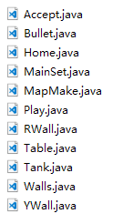

# TankWar
JAVASE's school work which used JAVA, can change your map, but load map is not well.

The project made by IDEA, here are all files include .project.

In the package TankWar, MainSet is the entrance to the program

>Accept.Java is responsible for a part of communication between the two parties, the other part is in the Play.java.Other programs are responsible for the reading of the file and the operation logic of the tank

---

My project is very simple, try playing if you are interested.